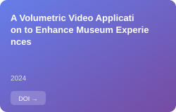
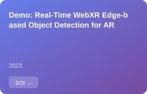

# James Lam's personal blog repository.

URL: [http://kitylam9.github.io](http://kitylam9.github.io)

<!-- BEGIN ORCID-CARDS -->
  

<!-- END ORCID-CARDS -->

The original theme of this blog is [Minimal Theme](http://orderedlist.github.com/minimal/)

This is the raw HTML and styles that are used for the *minimal* theme on [GitHub Pages](http://pages.github.com/).

Syntax highlighting is provided on GitHub Pages by [Pygments](http://pygments.org).

# License

Basically, the original theme is licensed under a [Creative Commons Attribution-ShareAlike 3.0 Unported License](http://creativecommons.org/licenses/by-sa/3.0/).

This blog has been built by modifying the original work: [Minimal Theme](http://orderedlist.github.com/minimal/).

